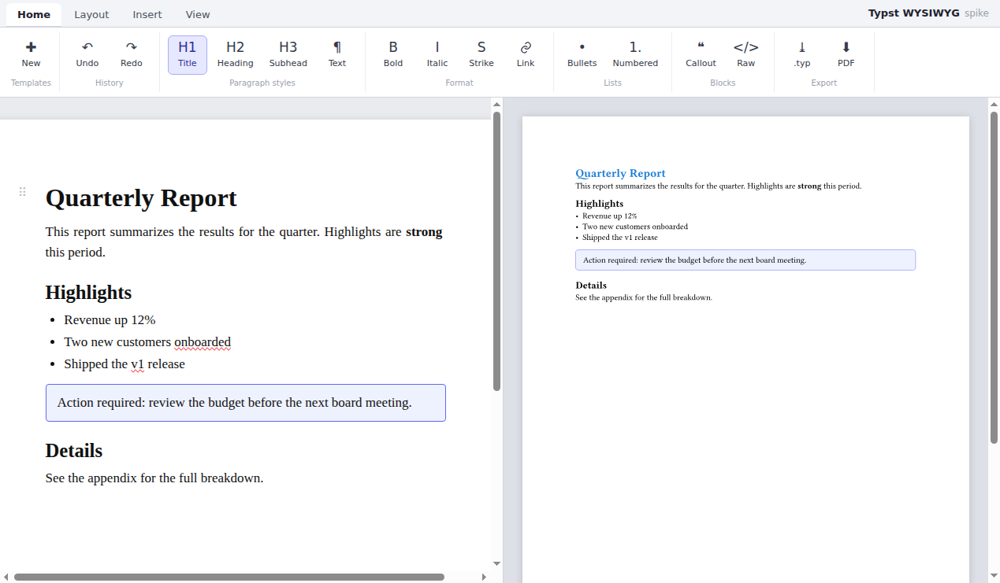

# typst-wysiwyg

A **prototype** for a WYSIWYG editor for [Typst](https://typst.app) — created using AI
(Claude Code).

It explores what a block-based, "normal user" friendly editor for Typst could look
like: you edit a real document on a page-styled canvas, while the Typst-specific
machinery (`#set` rules, `#let` definitions, templates) is managed through a familiar
Word-style ribbon instead of raw code.

> ⚠️ This is an early prototype / spike, not a finished product. It is meant to
> validate the core idea and UX, not to be production-ready.



## The core idea

Typst isn't a document format — it's a programming language. So instead of trying to
round-trip arbitrary `.typ` files, the editor **owns a structured document model** and
compiles it one way to Typst:

```
structured model (JSON AST)  ──▶  generated .typ  ──▶  Typst compiler (WASM)  ──▶  SVG / PDF
```

There is deliberately **no Typst parser**: the prototype only creates new documents.
Import of existing `.typ` is a future, tightly-scoped concern.

### Two layers

- **Content layer** — a true WYSIWYG canvas backed by **ProseMirror** (via TipTap), so
  selection, clipboard, undo/redo and inline marks all behave like a real editor.
  Headings look like headings, lists like lists, the callout like a box. Type directly,
  use markdown-style shortcuts (`# `, `- `, `**bold**`), apply **bold / italic /
  strike / links** inline, and use the Notion-style six-dot handle (⠿) next to the
  current block to change its type, move, insert or delete it. A raw-Typst block is the
  power-user escape hatch.
- **Logic / style layer** — `#set`, `#let` and `#show`, managed through the ribbon
  (Layout tab for page/text/paragraph settings, Insert → Definitions for `#let`
  bindings, Insert → Show rules for a structured `#show` editor). Normal users never
  touch code.

### Templates

Because a document is just data, a **template is a saved document**. The picker is a
searchable modal of templates (Blank, Letter, Report, Invoice, Meeting Notes), each with
an icon.

## Features in this prototype

- Word-style **ribbon**: Home / Layout / Insert / View tabs.
- **ProseMirror-backed WYSIWYG editing** with real selection, clipboard, undo/redo and
  markdown-style input rules.
- **Inline formatting**: bold, italic, strike, links.
- **Tables** — editable (add/remove rows & columns, resizable), full-width, serialized
  to `#table(...)`.
- **Images** — insert a picture; it renders in the live preview too (the bytes are fed
  to the Typst compiler's virtual filesystem) and serializes to `#image(...)`.
- **Equations** — a block equation with a live-rendered (Typst-compiled) preview above an
  editable source field; serializes to `$ … $`.
- **Inline math** — render Typst math at text size inside a paragraph; serializes to `$…$`.
- **Page breaks** (`#pagebreak()`) and **footnotes** (inline marker + popover editor →
  `#footnote[…]`).
- **Block handle** (⠿) for changing block type, moving, inserting and deleting.
- **Context-sensitive ribbon tabs** (Word-style): selecting an image shows an **Image**
  tab (width, border); working in a table shows a **Table** tab (rows/columns, header,
  striped, borders).
- Structured **`#show` rule editor** (restyle headings, emphasis, links, …) and a
  **`#let` definitions** editor.
- **Live Typst preview** (compiled in the browser via WASM), hidden by default and
  toggled from the View tab.
- **Typst source viewer** with syntax highlighting (View → Typst source).
- **Template gallery** with search and icons.
- **Export** to `.typ` and PDF.
- Built-in `callout` component and a **raw Typst** escape hatch.

## Tech

- [Vite](https://vitejs.dev/) + TypeScript, plain DOM for the chrome (ribbon/modals).
- [TipTap](https://tiptap.dev/) / [ProseMirror](https://prosemirror.net/) for the
  editing canvas.
- [`@myriaddreamin/typst.ts`](https://github.com/Myriad-Dreamin/typst.ts) — the Typst
  compiler + renderer compiled to WebAssembly, for live preview and export.

## Run

```bash
npm install
npm run dev      # http://localhost:5173
npm run build    # typecheck + production build
```

The first load fetches a ~28 MB WASM compiler; give it a moment on a cold start.

## Source map

| File | Role |
|------|------|
| `src/model.ts` | The logic layer the editor owns (`#set` / `#let` / `#show`) |
| `src/editor.ts` | TipTap/ProseMirror schema, custom Callout node, editor factory |
| `src/serialize.ts` | ProseMirror document → Typst markup (inc. inline marks) |
| `src/generate.ts` | Logic layer + serialized content → full `.typ` |
| `src/blockhandle.ts` | The six-dot block handle and its block-style menu |
| `src/typst.ts` | typst.ts (WASM) wrapper: `renderSvg` / `renderPdf` |
| `src/highlight.ts` | Lightweight Typst syntax highlighter for the source viewer |
| `src/templates.ts` | Templates (logic layer + ProseMirror content), picker icons |
| `src/main.ts` | Ribbon, modals, preview, export — the UI shell |

## Roadmap / next steps

Roughly in priority order. The first group is the most-requested missing content.

### Rich content blocks (highest priority)

- ✅ **Tables** — done (editable, resizable, full-width, `#table(...)`).
- ✅ **Images** — done (insert from file; rendered in the preview via the compiler's
  virtual filesystem; `#image(...)`). Still to add: drag-in, resizing, and a **figure**
  wrapper (caption + label) → `#figure(image("..."), caption: [...])`.
- ✅ **Equations** — done (block + inline math, both live-rendered, `$ … $`).
- ✅ **Footnotes** — done (`#footnote[...]`). Still to add: labels + cross-references
  (`<label>` / `@ref`), and `#cite` / `#bibliography`.
- **Page breaks, columns and code listings** — ✅ page break (`#pagebreak()`) done; still
  to add multi-column layout and a real (display) code block distinct from the raw-Typst
  escape hatch.

### Editing experience

- **Slash menu** (`/`) and a selection bubble toolbar for fast block/inline insertion.
- **Drag-to-reorder** blocks from the six-dot handle (currently move up/down only).
- **Find & replace**, and a document **outline / table-of-contents** panel (`#outline()`).

### Document & logic layer

- **Full function-style `#show` rules** (`#show heading: it => …`); the structured editor
  covers common text restyling, the rest still needs the raw-Typst escape hatch.
- **Headers/footers and page numbering**, font/color pickers, and per-section page setups.

### Persistence & app

- **Save / load** documents (state is currently in-memory only) with autosave.
- **Import of existing `.typ`** — the model is generated one-way today; import needs a
  parser and will be tightly scoped.
- **User templates** — save the current document as a reusable template.
- **Desktop packaging** via a **Tauri** shell (local fonts, file system, offline).

### Engineering / hardening

- **Harden the serializer** and add golden round-trip tests — known rough edges include
  `code`-marked text not being escaped inside backticks, deeply nested lists, and unusual
  selections.
- **Map Typst compiler errors back to blocks** instead of showing a raw message.
- **Compile in a web worker** and tune debouncing for large documents.

### Explicitly deferred

- **Real-time collaboration** — out of scope for now (single-user, local-first).

## License

[MIT](LICENSE) © Ortic

---

🤖 Built with [Claude Code](https://claude.com/claude-code).
